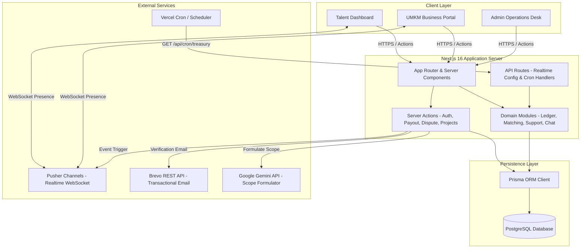
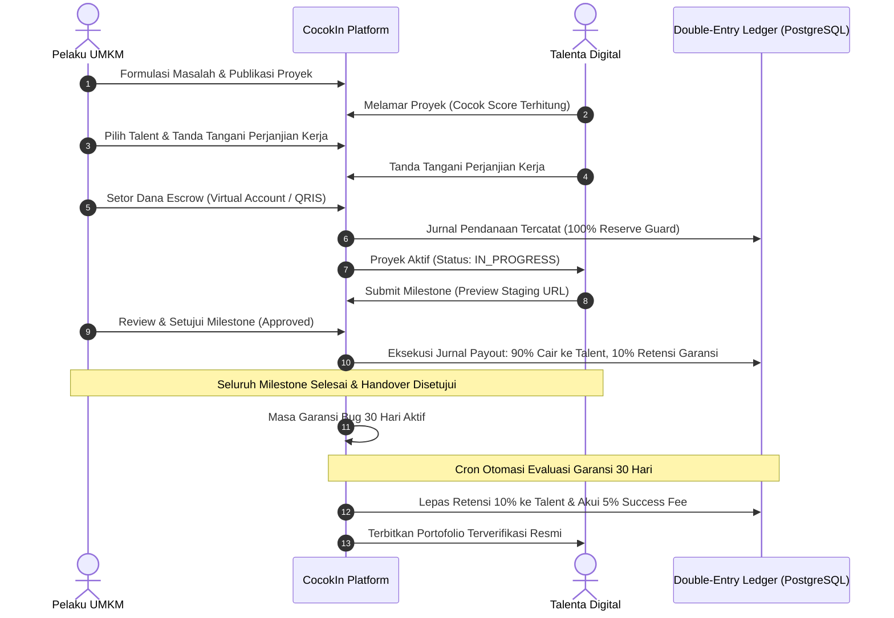

<div align="center">

  # CocokIn

  ### Ubah Potensi Jadi Bukti, Selesaikan Solusi Pasti.

  [](https://cocok-in-git-dev-zakyryan0-4528s-projects.vercel.app/)
  [](https://github.com/jajakiman/CocokIn.git)
  [](https://nextjs.org/)
  [](https://www.typescriptlang.org/)
  [](https://www.postgresql.org/)
  [](https://www.prisma.io/)
  [](https://vitest.dev/)
  [](LICENSE)

  **Submission for ITECHNO CUP 2026 - Web Development**

  **By Acim Bilek**

</div>

---

## 📋 Daftar Isi

- [Tentang Proyek](#-tentang-proyek)
  - [Latar Belakang](#latar-belakang)
  - [Solusi yang Ditawarkan](#solusi-yang-ditawarkan)
  - [Tujuan Proyek & SDGs Alignment](#tujuan-proyek--sdgs-alignment)
- [Tim Developer](#-tim-developer)
- [Fitur Unggulan](#-fitur-unggulan)
  - [Fitur Utama](#fitur-utama)
  - [Fitur Tambahan](#fitur-tambahan)
- [Demo & Screenshot](#-demo--screenshot)
- [Teknologi](#-teknologi)
  - [Tech Stack](#tech-stack)
  - [Alasan Pemilihan Teknologi](#alasan-pemilihan-teknologi)
- [Arsitektur Sistem](#-arsitektur-sistem)
  - [System Architecture](#system-architecture)
  - [Project Lifecycle Sequence](#project-lifecycle-sequence)
  - [Folder Structure](#folder-structure)
- [Instalasi & Setup](#-instalasi--setup)
  - [Prerequisites](#prerequisites)
  - [Langkah Instalasi](#langkah-instalasi)
- [Penggunaan](#-penggunaan)
  - [Available Scripts](#available-scripts)
  - [User Guide](#user-guide)
- [API Documentation](#-api-documentation)
- [Testing](#-testing)
- [Lisensi](#-lisensi)

---

## 👥 Tim Developer

Platform **CocokIn** dikembangkan oleh tim **Acim Bilek** dengan prinsip *vertical slice ownership*:

| Nama | Peran & Tanggung Jawab | GitHub |
|---|---|---|
| **Muhammad Zaky Ryan Ardhiansyah** | **Project Lead & Talent Experience Owner**<br>Design System ([MASTER.md](design-system/cocokin/MASTER.md)), *Career Readiness Assessment*, Taksonomi Skill & *Skill Gap Analyzer*, *Smart Matching Engine* (Cocok Score), *Skill Passport*, Portofolio Terverifikasi, dan UI Accessibility. | [@jajakiman](https://github.com/jajakiman) |
| **Hajjid Rafi Mumtaz** | **UMKM Marketplace & Delivery Owner**<br>*Digital Readiness Assessment* (5 pilar UMKM), *Problem-to-Project Formulator*, Marketplace Proyek, Seleksi Pelamar & Kontrak Kerja, *Milestone Workspace*, Staging Review, *Real-time Pusher Chat*, dan *Production Handover*. | [@rafimumtaz](https://github.com/rafimumtaz) |
| **Farid Munadhil** | **Platform Trust & Financial Operations Owner**<br>Database & Prisma Architecture, Session Auth & Security, *Double-Entry Balanced Ledger*, *Escrow 100% Liability Reserve*, Rekonsiliasi VA/QRIS, Payout 90%, Retensi Garansi 30 Hari (10%), Dispute Desk, dan *Operational Automation Cron*. | [@FrdMnhdl](https://github.com/FrdMnhdl) |

---

## 🎯 Tentang Proyek

### Latar Belakang

Di era transformasi digital saat ini, terdapat kesenjangan (*gap*) mendasar di antara dua pilar ekonomi Indonesia:
1. **Talenta Digital Muda (Mahasiswa & Fresh Graduate):** Memiliki keahlian teknis pemrograman dan desain, namun sulit menembus dunia kerja profesional karena terbentur syarat **"wajib berpengalaman kerja dan memiliki portofolio nyata"**. Mereka juga kerap tidak mengetahui secara objektif keahlian apa yang masih kurang (*skill gap*) terhadap standar industri.
2. **Usaha Mikro, Kecil, dan Menengah (UMKM):** Membutuhkan digitalisasi praktis (website katalog, kasir POS, otomatisasi inventori, landing page) untuk ekspansi bisnis, tetapi terhambat oleh **keterbatasan budget**, kebingungan menghadapi terminologi teknis yang rumit, serta kekhawatiran dana hilang akibat pengerjaan proyek yang mangkrak atau tidak tuntas.

### Solusi yang Ditawarkan

**CocokIn** hadir sebagai **Marketplace-Enabled Vertical SaaS** yang menghubungkan kedua belah pihak secara aman, terukur, dan transparan melalui pengerjaan proyek mikro (*micro-projects*):
* **Untuk Talent:** Mengubah potensi akademis menjadi portofolio nyata yang **terverifikasi langsung oleh pemilik usaha UMKM**, dilengkapi asesmen kesiapan karier (*Career Readiness*) dan paspor keahlian digital (*Skill Passport*).
* **Untuk UMKM:** Membantu adopsi teknologi secara bertahap tanpa risiko finansial berlebih, menggunakan bahasa bisnis non-teknis, rekomendasi infrastruktur mandiri, dan jaminan keamanan dana transaksi.
* **Escrow Terisolasi & Double-Entry Ledger:** Mengamankan dana UMKM dengan cadangan kas 100% (*100% Liability Reserve Invariant*), pencairan bertahap per milestone yang disetujui (90% cair ke talent, 10% ditahan sebagai garansi kualitas), serta jaminan perbaikan bug gratis selama 30 hari.

### Tujuan Proyek & SDGs Alignment

Proyek ini dirancang selaras dengan agenda pembangunan berkelanjutan PBB:
* 🎯 **SDG 8: Decent Work & Economic Growth** — Membuka akses kesempatan kerja berbasis kompetensi nyata bagi talenta muda dan mendorong pertumbuhan ekonomi sektor riil UMKM.
* 🎯 **SDG 9: Industry, Innovation, and Infrastructure** — Mempercepat adopsi infrastruktur digital bagi usaha mikro dan menstandarisasi serah terima sistem digital yang berkelanjutan.

---

## ✨ Fitur Unggulan

### Fitur Utama

| Fitur | Deskripsi | Keunggulan |
|---|---|---|
| **Smart Cocok Score Engine** | Algoritma pencocokan multi-faktor deterministik antara profil Talent dengan kualifikasi Proyek UMKM. | Menghasilkan skor kecocokan transparan (0–100%) beserta penjabaran faktor penentu (*Explainable Match Summary*). |
| **Double-Entry Balanced Ledger & Escrow** | Sistem pembukuan berpasangan (*zero-sum*) di tingkat database PostgreSQL untuk seluruh mutasi dana. | Menjamin dana aman dengan invariant matematis: Saldo Kas Bank $\ge$ Total Kewajiban Pengguna (*100% Reserve Guard*). |
| **5-Pillar Digital Readiness Assessment** | Kuesioner diagnosis kapabilitas digital UMKM (Presence, Sales, Operations, Customer, Marketing). | Mengukur tingkat kesiapan adopsi teknologi bisnis secara objektif sebelum proyek dimulai. |
| **Problem-to-Project Formulator** | Fitur formulasi kebutuhan proyek dari keluhan operasional UMKM berbahasa non-teknis. | Menerjemahkan kebutuhan bisnis menjadi ruang lingkup, milestone, dan kriteria penerimaan terstruktur. |
| **Milestone Review Hub & Staging Preview** | Panel review hasil pengerjaan milestone terintegrasi dengan pratinjau langsung URL staging HTTPS. | UMKM dapat menguji aplikasi secara interaktif; pencairan 90% dana milestone dipicu hanya setelah UMKM memberi approval. |
| **30-Day Quality Bug Warranty & Handover** | Perlindungan purna-jual berupa garansi perbaikan bug gratis selama 30 hari kalender pasca-serah terima. | Dana retensi 10% milik talent disimpan aman dan otomatis dicairkan setelah masa garansi berakhir tanpa sengketa. |
| **Real-time Project Chat** | Ruang obrolan langsung antara UMKM dan Talent per proyek berbasis Pusher Channels dan PostgreSQL. | Komunikasi instan dengan riwayat pesan terarsip aman di PostgreSQL (tetap tersimpan jika koneksi terputus). |

### Fitur Tambahan

* **Skill Passport (4-Level Evidence):** Menampilkan tingkat keabsahan keahlian talent (*Self-Declared* $\rightarrow$ *Assessed* $\rightarrow$ *Project Applied* $\rightarrow$ *Project Verified*).
* **Automated Verified Portfolio:** Menerbitkan halaman portofolio resmi bagi proyek berstatus `COMPLETED` dengan stempel persetujuan dari pemilik usaha.
* **Operational Automation Cron (`/api/cron/treasury`):** Background job terjadwal untuk mengotomasi pencairan payout milestone jatuh tempo (`PAYOUT_DUE`), evaluasi pelepasan retensi garansi 30 hari, dan rekonsiliasi balance sheet escrow.
* **Admin Operations & Dispute Desk:** Panel kontrol admin terpadu untuk moderasi akun, peninjauan laporan pelanggaran, pemantauan metrik SDG, serta penyelesaian sengketa proyek secara adil.

---

## 📸 Demo & Screenshot

### Live Demo
🔗 **[Kunjungi Website CocokIn](https://cocok-in-git-dev-zakyryan0-4528s-projects.vercel.app/)** *(Live Deployment on Vercel)*

### Akun Demo Uji Coba

Untuk mempermudah pengujian seluruh alur aplikasi, database telah dilengkapi akun demo siap pakai:

| Role | Email | Password | Keterangan Akun |
|---|---|---|---|
| **UMKM (Business)** | `umkm@cocokin.id` | `password123` | Profil *"Kopi Kenangan Senja"*, memiliki draf proyek dan alur pendanaan escrow. |
| **Talent** | `talent@cocokin.id` | `password123` | Profil *"Budi Santoso"* (Fullstack Developer), memiliki skill terverifikasi dan workspace. |
| **Admin** | `admin@cocokin.id` | `password123` | Operator platform untuk pengawasan balance sheet escrow, moderasi, dan dispute. |

---

## 🛠️ Teknologi

### Tech Stack

#### Frontend
```
Framework    : Next.js 16 (App Router)
Library      : React 19
Styling      : Vanilla CSS Design Tokens + Tailwind CSS v4
Typography   : Plus Jakarta Sans (next/font)
Icons        : Phosphor Icons (@phosphor-icons/react)
```

#### Backend
```
Runtime      : Node.js (v22.x LTS)
Architecture : Next.js Server Actions & Route Handlers
Database     : PostgreSQL 16 (Supabase / Neon / Local PostgreSQL)
ORM          : Prisma ORM 5.22
Auth         : Stateless Signed JWT Session (jose 5.9) + Bcrypt.js
AI Assisting : Google GenAI SDK (@google/genai 2.21)
```

#### DevOps & Tools
```
Deployment   : Vercel Platform
Realtime     : Pusher Channels (WebSocket)
Email Service: Brevo REST API (Transactional Email)
Testing      : Vitest 4.0 + Testing Library + Playwright
Linter       : ESLint 9 + TypeScript 5.9
Package Mgr  : pnpm 10
```

### Alasan Pemilihan Teknologi

| Teknologi | Alasan Pemilihan & Keunggulan |
|---|---|
| **Next.js 16 + React 19** | Memberikan performa maksimal dengan Server Components untuk SEO publik, serta Server Actions untuk mutasi data aman tanpa perlu mengekspos endpoint API publik yang rentan. |
| **PostgreSQL + Prisma ORM** | Menjamin integritas data relasional, transaksi atomic multi-tabel (`$transaction`), isolasi serializable, dan penegakan skema keuangan berpasangan (*double-entry ledger*). |
| **Pusher Channels + PostgreSQL** | Memberikan pengalaman chat instan via WebSocket tanpa membebani database, namun pesan tetap tersimpan permanen di PostgreSQL sebagai *single source of truth*. |
| **BigInt Native IDR Money** | Seluruh nominal transaksi dihitung dalam representasi integer Rupiah presisi tinggi guna mencegah bug pembulatan desimal (*floating point rounding errors*). |

---

## 🏗️ Arsitektur Sistem

### System Architecture



### Project Lifecycle Sequence



### Folder Structure

```text
CocokIn/
├── app/                                 # Next.js 16 App Router (Pages & API Routes)
│   ├── (dashboard)/                     # Protected dashboard routes
│   │   ├── business/                    # UMKM project management & applicants
│   │   ├── talent/                      # Talent workspace, passport & assessments
│   │   └── projects/[id]/chat/          # Real-time project chat
│   ├── (onboarding)/                    # User onboarding wizards
│   ├── admin/                           # Admin operations & moderation desk
│   ├── api/                             # Internal API routes
│   │   ├── cron/treasury/               # Operational automation cron route
│   │   └── realtime/                    # Pusher auth & configuration
│   ├── layout.tsx                       # Root shell layout
│   └── globals.css                      # Design tokens & typography
├── design-system/                       # Master tokens, guidelines & visual contract
├── docs/                                # ADRs, business rules & system specifications
├── prisma/                              # Prisma schema & migrations
│   ├── schema.prisma                    # PostgreSQL relational data models
│   ├── migrations/                      # Versioned SQL migration files
│   └── seed.ts                          # Synthetic seed data script
├── src/
│   ├── adapters/                        # Infrastructure adapters (Database, Pusher, Email)
│   ├── components/                      # Modular UI components
│   ├── design-system/                   # Primitive UI components (Button, Modal, Card)
│   ├── domain/                          # Pure business logic & calculation engines
│   ├── lib/                             # Core utilities (Money BigInt, Clock, JWT Session)
│   └── modules/                         # Vertical business modules
│       ├── chat/                        # Chat service & message persistence
│       ├── disputes/                    # Dispute resolution & refund ledger
│       ├── matching/                    # Cocok Score matching algorithm
│       ├── payments/                    # Double-entry ledger, funding & payouts
│       ├── support/                     # 30-day warranty tickets & retention release
│       └── talent/                      # Career readiness & skill taxonomy
└── vitest.config.ts                     # Automated unit & integration test configuration
```

---

## ⚙️ Instalasi & Setup

### Prerequisites

Pastikan environment Anda telah memiliki:
* **Node.js** versi `22.x` atau lebih tinggi
* **pnpm** (direkomendasikan) atau **npm**
* **PostgreSQL** database (Supabase, Neon, atau PostgreSQL lokal)
* **Git**

### Langkah Instalasi

#### 1️⃣ Clone Repository
```bash
git clone https://github.com/jajakiman/CocokIn.git
cd CocokIn
```

#### 2️⃣ Install Dependencies
```bash
# Menggunakan pnpm
pnpm install

# Atau menggunakan npx jika pnpm belum terpasang global
npx pnpm install
```

#### 3️⃣ Setup Environment Variables
Buat file `.env` di root directory:
```bash
cp .env.example .env
```

Isikan kredensial koneksi pada file `.env`:
```env
# Database Connection (PostgreSQL)
DATABASE_URL="postgresql://postgres:[PASSWORD]@[HOST]:6543/postgres?pgbouncer=true&connection_limit=1&sslmode=require"
DIRECT_URL="postgresql://postgres:[PASSWORD]@[HOST]:5432/postgres?sslmode=require"

# Session Secret (minimal 32 karakter acak)
SESSION_SECRET="cocokin-super-secret-session-key-32-chars-min"

# Application URL
APP_URL="http://localhost:3000"

# Operational Cron Secret (opsional untuk testing lokal)
CRON_SECRET="optional-cron-secret-token"

# External Integrations (opsional untuk realtime chat & email)
PUSHER_APP_ID="your-pusher-app-id"
PUSHER_KEY="your-pusher-key"
PUSHER_SECRET="your-pusher-secret"
PUSHER_CLUSTER="ap1"

BREVO_API_KEY="your-brevo-api-key"
BREVO_SENDER_EMAIL="your-verified-sender@example.com"
BREVO_SENDER_NAME="CocokIn Ecosystem"
```

#### 4️⃣ Database Migration & Seeding
```bash
# Generate Prisma Client
npx prisma generate

# Jalankan migrasi database
npx prisma migrate deploy

# Isi data demo sintetis
npx prisma db seed
```

#### 5️⃣ Jalankan Development Server
```bash
npx pnpm dev
```
Buka browser di: **`http://localhost:3000`**

---

## 🚀 Penggunaan

### Available Scripts

| Perintah | Deskripsi |
|---|---|
| `pnpm dev` / `npx pnpm dev` | Menjalankan Next.js development server |
| `pnpm build` | Membangun production build teroptimasi |
| `pnpm start` | Menjalankan production server |
| `pnpm typecheck` | Menjalankan pengecekan tipe TypeScript (`tsc --noEmit`) |
| `pnpm test` / `npx vitest run` | Menjalankan seluruh test suite otomatis |
| `pnpm lint` | Menjalankan pengecekan linter ESLint |

### User Guide

#### 💼 Untuk UMKM (Business Role)
1. **Login:** Masuk melalui `/login` dengan akun `umkm@cocokin.id` (password: `password123`).
2. **Buat Proyek:** Masuk ke menu *"Buat Proyek Baru"*, deskripsikan kebutuhan usaha, dan formulator akan menyusun draf spesifikasi proyek.
3. **Pilih Talent:** Buka daftar pelamar, bandingkan *Cocok Score*, dan pilih talent yang paling sesuai.
4. **Tanda Tangan & Setor Escrow:** Setujui perjanjian kerja dan lakukan pembayaran simulasi Virtual Account/QRIS di halaman pendanaan.
5. **Review Milestone:** Uji hasil kerja talent di tautan staging preview, lalu berikan approval untuk mencairkan termin pembayaran.

#### 🎓 Untuk Talent (Talent Role)
1. **Login:** Masuk melalui `/login` dengan akun `talent@cocokin.id` (password: `password123`).
2. **Asesmen Kesiapan:** Ikuti asesmen kesiapan karier untuk memetakan keahlian dan melihat *skill gap*.
3. **Cari Proyek:** Buka *Marketplace Proyek*, periksa persentase *Cocok Score*, dan kirimkan lamaran.
4. **Eksekusi di Workspace:** Serahkan URL staging deliverable per milestone dan diskusikan perkembangan proyek di ruang chat *real-time*.
5. **Klaim Portofolio:** Dapatkan pencairan dana ke rekening dan terbitkan portofolio resmi terverifikasi UMKM setelah serah terima tuntas.

---

## 📚 API Documentation

### Operational Automation Cron Endpoint

Endpoint ini dirancang untuk dijalankan secara otomatis (misalnya oleh Vercel Cron setiap malam):

```http
GET /api/cron/treasury
Authorization: Bearer <CRON_SECRET>
```

**Operasi Otomatis yang Dijalankan:**
1. **Payout Otomatis:** Mengeksekusi seluruh instruksi payout milestone berstatus `PAYOUT_DUE` ke rekening talent via `executePayoutTransfer()`.
2. **Pelepasan Retensi Garansi:** Mengevaluasi garansi aktif yang telah melewati batas 30 hari tanpa sengketa terbuka via `checkAndReleaseWarrantyRetention()`, melepas sisa retensi 10% ke talent, dan mencatat 5% success fee.
3. **Audit Balance Sheet:** Memverifikasi kesehatan saldo escrow untuk memastikan tidak ada defisit kas (*100% Reserve Invariant*).

**Response JSON:**
```json
{
  "ok": true,
  "timestamp": "2026-09-06T12:00:00.000Z",
  "summary": {
    "payoutsFound": 2,
    "payoutsSuccessful": 2,
    "warrantiesFound": 1,
    "warrantiesReleased": 1,
    "isReserveHealthy": true,
    "coverageRatioPercent": 100
  },
  "details": {
    "balanceSheet": {
      "cashAtBank": "15500000",
      "requiredReserve": "15500000",
      "reserveDeficit": "0",
      "isHealthy": true
    }
  }
}
```

---

## 🧪 Testing

CocokIn menerapkan pengujian otomatis menyeluruh untuk memastikan keandalan logika bisnis dan integritas data keuangan:

```bash
# Menjalankan seluruh test suite
npx vitest run
```

### Hasil Validasi Testing

```text
✓ src/modules/payments/ledger/ledger.test.ts (11 tests)
✓ src/modules/matching/calculate-cocok-score.test.ts (5 tests)
✓ src/modules/support/warranty.test.ts (6 tests)
✓ src/modules/payments/funding/funding.test.ts (7 tests)
✓ src/lib/money/money.test.ts (16 tests)
✓ src/modules/payments/payout/payout.test.ts (7 tests)
✓ src/adapters/cron/treasury-route.test.ts (3 tests)
✓ src/modules/disputes/dispute.test.ts (3 tests)
✓ src/design-system/primitives-extended.test.tsx (4 tests)
...dan 52 file test suite lainnya.

Test Files  : 61 passed (61 test files)
Total Tests : 256 passed (256 unit & integration tests)
Typecheck   : 0 errors (tsc --noEmit)
Status      : 100% GREEN
```

---

## 📄 Lisensi

Proyek ini dilisensikan di bawah [MIT License](LICENSE).

---

<div align="center">

  **Made with ❤️ by Acim Bilek for ITECHNO CUP 2026**

</div>
