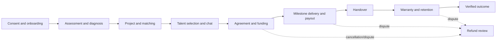
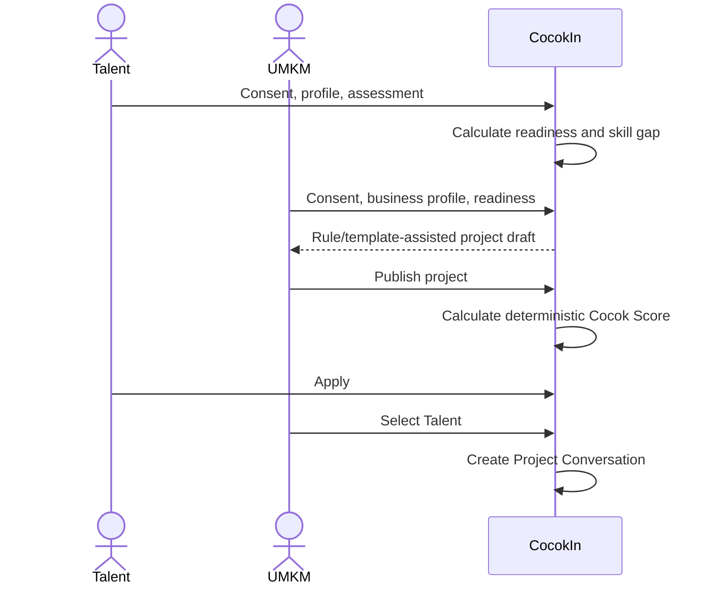
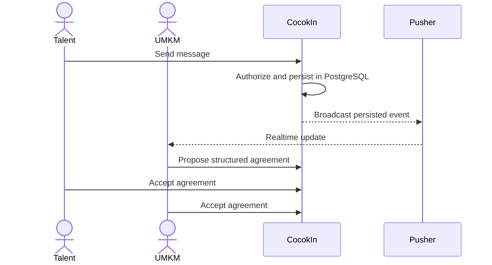
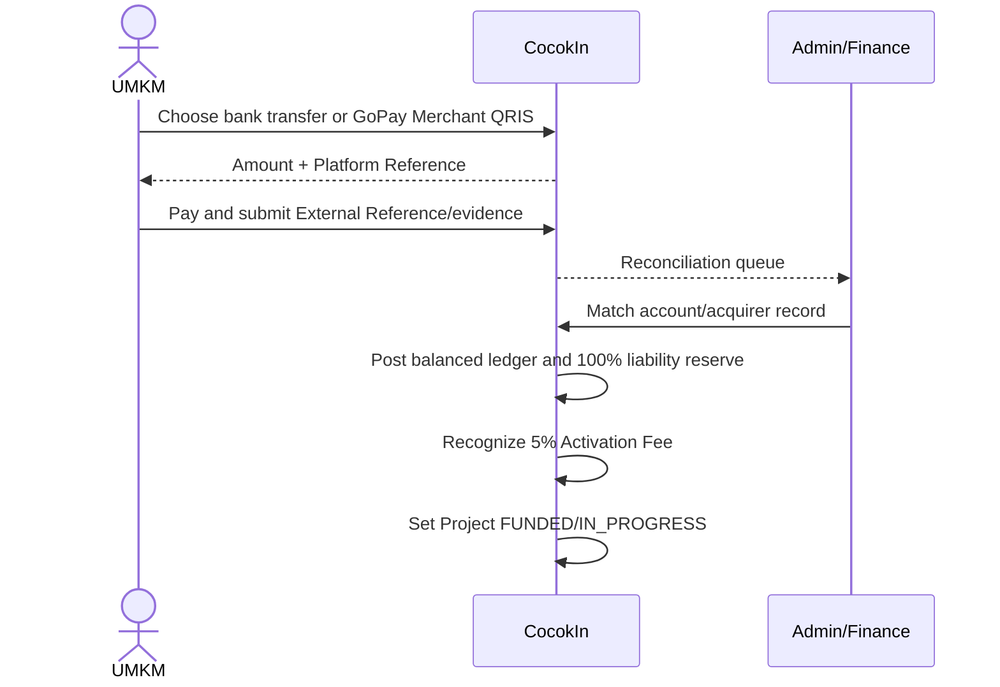
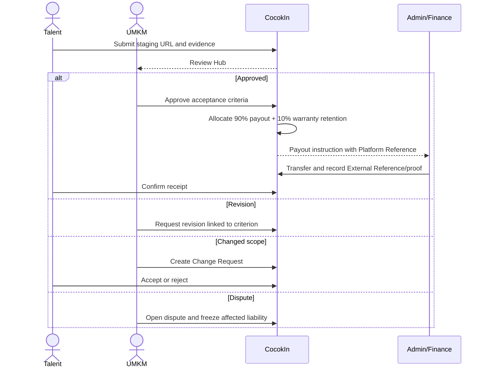
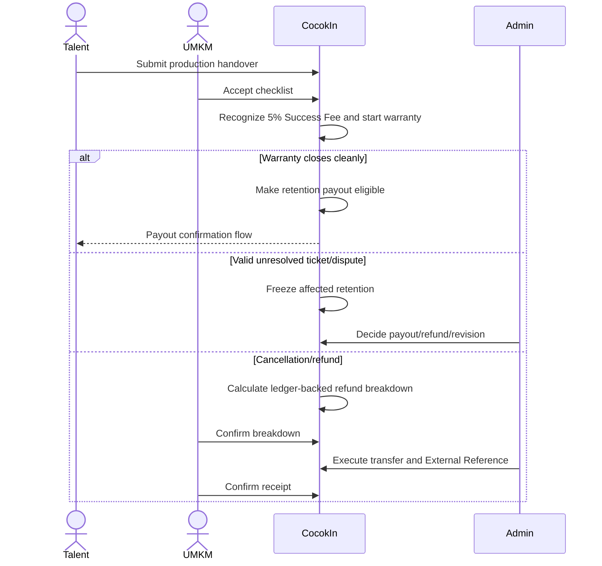

# CocokIn Business Flow

> **Audience:** Developers and QA  
> **Policy source:** [`BUSINESS_RULES.md`](BUSINESS_RULES.md)

## Actors

| Actor | Responsibility |
|---|---|
| Talent | Profile, assessment, application, delivery, chat, handover, warranty |
| UMKM | Diagnosis, project, funding, selection, review, infrastructure ownership |
| Admin/Finance | Verification, reconciliation, payout/refund execution, moderation, dispute |
| CocokIn | Deterministic matching, state guards, ledger, audit, notification orchestration |
| Pusher | Realtime delivery and presence only; never authoritative message storage |

## End-to-End Lifecycle

## Onboarding and Matching

Gemini may draft explanations from sanitized data but cannot determine a score, publish a project, approve work, or move money.

## Chat and Agreement

Typing and presence are ephemeral Pusher events. Messages, reactions, receipts, reports, and system events are persistent. Pusher failure falls back to polling without message loss. Chat cannot amend scope, value, deadline, approval, or financial state.

## Funding and Reconciliation

- Bank transfer is default; sender-bank fee is borne by UMKM.
- QRIS has no consumer surcharge. MDR is evidence-backed configuration and, if nonzero, borne by CocokIn.
- Proof upload alone never funds a Project.

## Milestone Review and Payout

CocokIn bears payout transfer cost. Approval and money movement are separate permissions and states.

## Handover, Warranty, and Refund

Refund transfer cost is borne by UMKM except when CocokIn caused the refund. Completion may generate a private portfolio draft; publication requires explicit Talent consent and UMKM attribution approval.
