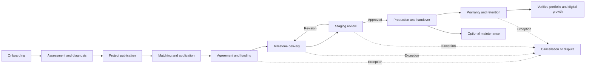
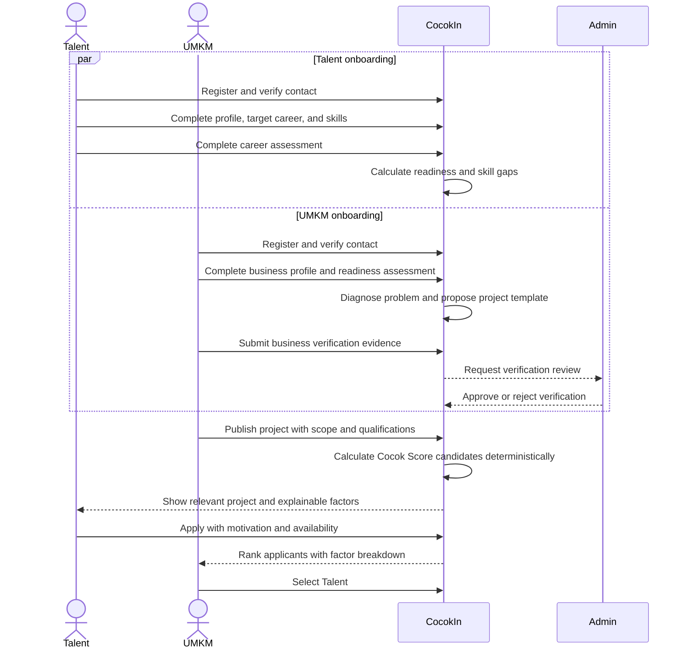
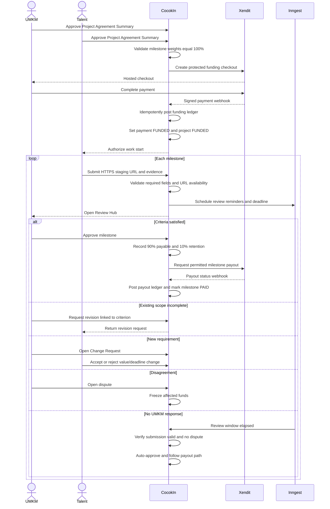
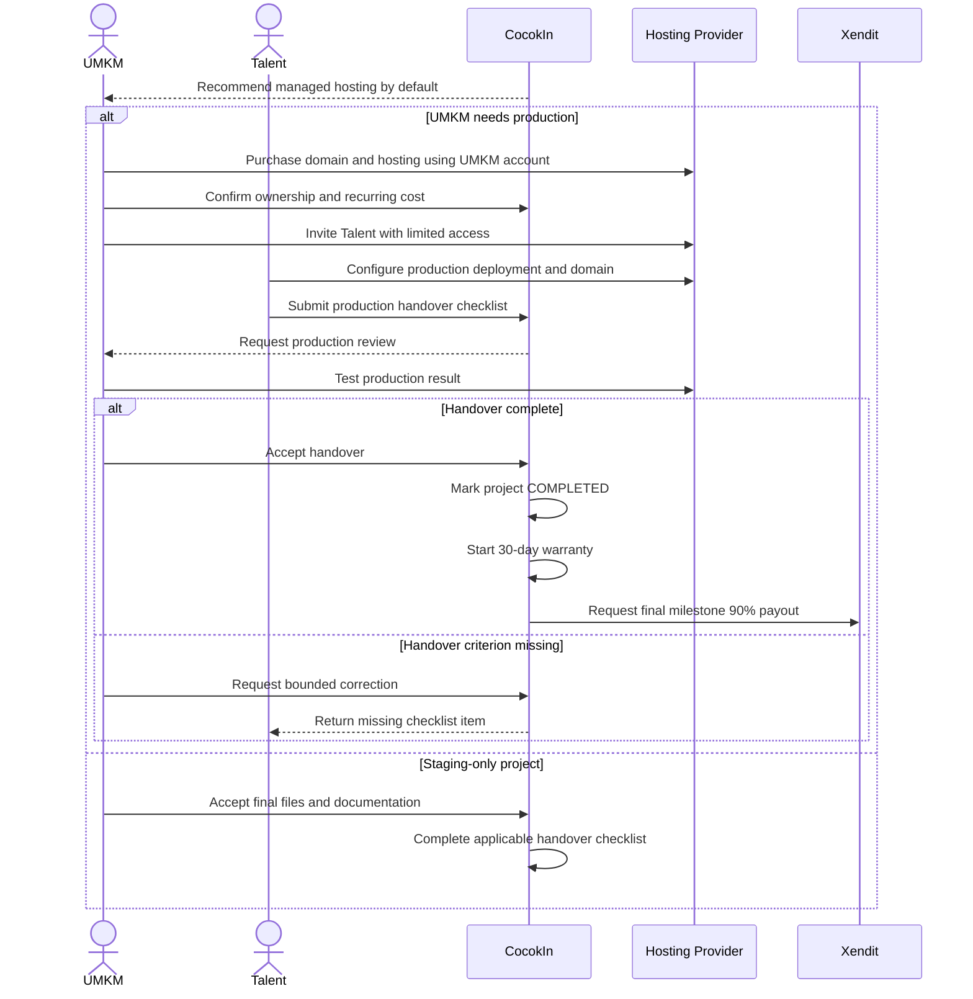
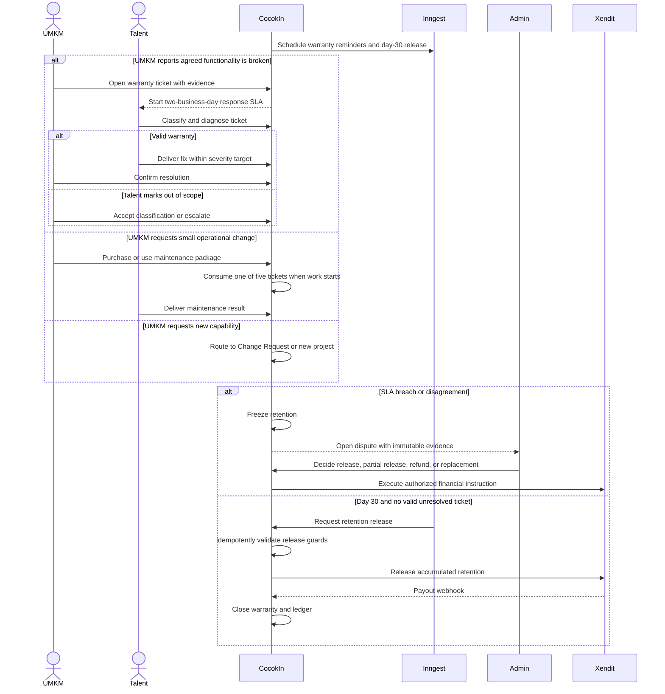

# CocokIn Business Flow

> **Applies to:** [`../PRD.md`](../PRD.md) v1.2 and [`BUSINESS_RULES.md`](BUSINESS_RULES.md) v1.0  
> **Audience:** Developers and QA  
> **Purpose:** Describe actor interactions, system decisions, state changes, and exception paths without redefining policy.

## 1. Actors and Responsibilities

| Actor | Primary responsibilities |
|---|---|
| Talent | Complete profile and assessment, apply to projects, deliver milestones, perform production handover, honor warranty. |
| UMKM | Complete business diagnosis, publish and fund projects, review outputs, own production infrastructure, accept handover. |
| Admin | Verify businesses, moderate content, review disputes, and authorize exceptional financial outcomes. |
| CocokIn | Calculate deterministic matching, enforce state guards, record audit history, orchestrate notifications and provider calls. |
| Xendit | Collect protected project funding, manage sub-accounts, execute split routing, payout, and refund operations. |
| External infrastructure provider | Host the UMKM production result under an account owned by the UMKM. |

## 2. Lifecycle Overview

Project, milestone, payment, infrastructure, warranty, and maintenance state changes are independent. See [`DATA_STATE_MODEL.md`](DATA_STATE_MODEL.md).

## 3. Onboarding, Diagnosis, and Matching

**Trigger:** A new Talent or UMKM creates an account.  
**Preconditions:** Contact information is verifiable.  
**Related requirements:** `FR-TAL-01..03`, `FR-BIZ-01..04`, `FR-MTC-01..02`.  
**Financial effect:** None.

### System outcomes

- Talent skills remain `SELF_DECLARED` or `ASSESSED` until project evidence raises their level.
- AI may draft a project explanation, but the UMKM must review it before publication.
- Gemini failure falls back to templates and deterministic rules; project publication remains available.
- A Cocok Score never authorizes acceptance automatically.

### Notifications

- Assessment completed.
- Business verification approved or rejected.
- Relevant project available.
- Application received, accepted, or rejected.

## 4. Agreement, Funding, and Milestone Delivery

**Trigger:** The UMKM selects a Talent.  
**Preconditions:** Project scope, one to four milestones, and acceptance criteria are complete.  
**Related requirements:** `FR-PRJ-01..03`, `FR-MIL-01..04`, `FR-PAY-01..03`.  
**Related policies:** `BR-AGR-*`, `BR-PAY-01`, `BR-SUB-*`, `BR-REV-*`.

### Guards and failure paths

- Funding webhook signature and idempotency key must be valid.
- Work cannot start from a browser-only status change; funding is confirmed server-side.
- If staging is unavailable, the review timer pauses and auto-approval is blocked.
- `REVISION_REQUESTED` cannot add scope. New scope uses `CHANGE_REQUESTED`.
- Provider calls happen outside database transactions; confirmed results are reconciled through webhooks.
- Xendit split/refund mismatches enter an operations queue for compensating transfer.

### Financial effects

Formulas are canonical in `BR-FEE-*` and `BR-REV-03`. Each approved milestone makes 90% immediately payable and accumulates 10% as project warranty retention. CocokIn recognizes fees only on successfully released Service Value.

## 5. Infrastructure, Production, and Handover

**Trigger:** Staging deliverables are approved and production is in scope.  
**Preconditions:** Infrastructure plan and ownership responsibilities are agreed.  
**Related requirements:** `FR-INF-01..02`, `FR-HOV-01`.  
**Related policies:** `BR-INF-*`, `BR-HOV-*`.

### Ownership rules

- Domain, hosting, VPS, database, and provider billing remain owned by the UMKM.
- Third-party costs are paid directly by the UMKM and excluded from CocokIn platform fees.
- Passwords, API keys, recovery codes, and private keys cannot be sent through CocokIn chat.
- VPS requires a documented reason, recurring cost, backup owner, security owner, and monitoring owner.

## 6. Warranty, Maintenance, and Dispute

**Trigger:** Handover is accepted.  
**Preconditions:** Production baseline and warranty start timestamp are recorded.  
**Related requirements:** `FR-SUP-01..02`, `FR-ADM-04`.  
**Related policies:** `BR-WAR-*`, `BR-MNT-*`, `BR-DSP-*`.

### SLA and support outcomes

- Talent acknowledges a complete warranty ticket within two Business Days.
- Repair targets are one Business Day for Critical, three for Major, and five for Minor.
- Maintenance lasts 30 calendar days and permits five small tickets with no rollover.
- A warranty defect never consumes maintenance quota.
- An out-of-scope request cannot extend retention.

## 7. Completion Effects

After the project and applicable financial operations complete:

1. CocokIn creates a verified portfolio entry for Talent.
2. Applied skills become `PROJECT_VERIFIED` when supported by accepted project evidence.
3. UMKM performs the post-project Digital Readiness assessment.
4. CocokIn records Digital Growth and SDG impact metrics.
5. Both parties may submit ratings after financial outcomes are final.

These effects must be idempotent because payment and background-job events may be retried.
