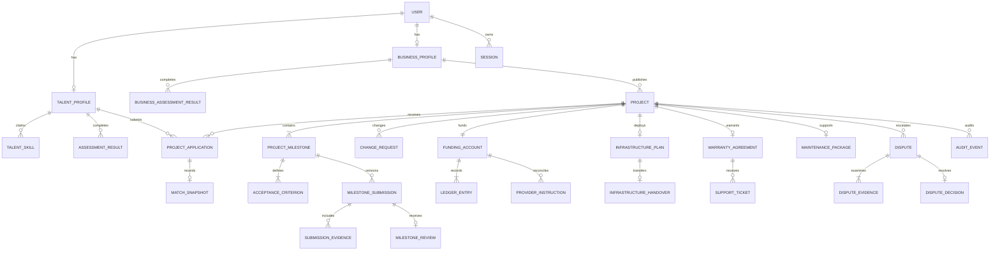

# CocokIn Data and State Model

> **Status:** Conceptual implementation contract  
> **Audience:** Developers and QA  
> **Related:** [`../PRD.md`](../PRD.md), [`BUSINESS_RULES.md`](BUSINESS_RULES.md), [`BUSINESS_FLOW.md`](BUSINESS_FLOW.md), [`TECHNICAL_ARCHITECTURE.md`](TECHNICAL_ARCHITECTURE.md)

This document defines ownership and transition contracts. Prisma model names may change only when the semantic boundary remains explicit.

## 1. Aggregate Boundaries

| Aggregate | Root | Owns |
|---|---|---|
| Identity | `User` | Accounts, sessions, roles, identity status, suspensions |
| Talent | `TalentProfile` | Career target, availability, skills, assessment results, passport |
| Business | `BusinessProfile` | Business verification, readiness results, industry profile |
| Project | `Project` | Requirements, applications, agreement, milestones, submissions, reviews, changes |
| Payment | `FundingAccount` | Provider references, ledger entries, payout/refund instructions, reconciliation |
| Infrastructure | `InfrastructurePlan` | Recommendation, ownership confirmation, handover checklist |
| Support | `WarrantyAgreement` | Warranty tickets, maintenance package, ticket activity, SLA timestamps |
| Dispute | `Dispute` | Evidence, Admin review, decision, resulting authorized instruction |
| Impact | `PortfolioEntry` | Verified skills, portfolio evidence, Digital Growth, impact metrics |

Cross-aggregate identifiers are referenced by ID. A module may read another aggregate through a published query but may mutate it only through that aggregate's domain service.

## 2. Core Relationships



## 3. Identity State

### Role

```text
TALENT | BUSINESS | ADMIN
```

A user has one active platform role in P0. A future multi-role requirement requires an explicit migration to memberships; do not prebuild it.

### IdentityStatus

| Current | Action | Actor | Next | Guard |
|---|---|---|---|---|
| `UNVERIFIED` | Verify contact | User/System | `CONTACT_VERIFIED` | Valid, unexpired verification challenge |
| `CONTACT_VERIFIED` | Submit KYC | User | `KYC_PENDING` | Required identity fields and provider consent complete |
| `KYC_PENDING` | Approve | Xendit/Admin adapter | `KYC_VERIFIED` | Signed provider result or authorized manual result |
| `KYC_PENDING` | Reject | Xendit/Admin adapter | `KYC_REJECTED` | Rejection reason stored |
| `KYC_REJECTED` | Resubmit | User | `KYC_PENDING` | Correctable rejection and new evidence |

KYC is required before Talent payout, not before browsing or assessment.

## 4. Project and Application State

### ProjectStatus

| Current | Action | Actor | Next | Guard |
|---|---|---|---|---|
| `DRAFT` | Publish | UMKM | `PUBLISHED` | Business eligible; project and milestone weights valid |
| `PUBLISHED` | Select Talent | UMKM | `TALENT_SELECTED` | Active application exists |
| `TALENT_SELECTED` | Confirm funding | Xendit webhook | `FUNDED` | Signed, idempotent settlement for expected amount |
| `FUNDED` | Start work | Talent/System | `IN_PROGRESS` | Agreement accepted by both parties |
| `IN_PROGRESS` | Submit for review | Talent | `STAGING_REVIEW` | Active milestone submission valid |
| `STAGING_REVIEW` | Continue work | System | `IN_PROGRESS` | More milestones remain or revision requested |
| `STAGING_REVIEW` | Begin production | UMKM/System | `PRODUCTION_DEPLOYMENT` | Staging scope approved and production required |
| `STAGING_REVIEW` | Begin handover | UMKM/System | `HANDOVER_PENDING` | Staging-only project complete |
| `PRODUCTION_DEPLOYMENT` | Submit handover | Talent | `HANDOVER_PENDING` | Production checklist submitted |
| `HANDOVER_PENDING` | Accept handover | UMKM | `COMPLETED` | Applicable checklist complete |
| Active nonfinal | Cancel | Authorized actor | `CANCELLED` | Cancellation policy and financial outcome recorded |
| Active nonfinal | Open dispute | Talent/UMKM/Admin | `DISPUTED` | Evidence category and affected amount recorded |

`COMPLETED` does not imply warranty, retention, or maintenance is closed.

### ApplicationStatus

```text
SUBMITTED → SHORTLISTED → ACCEPTED
         ↘ REJECTED
SUBMITTED → WITHDRAWN
```

Only one active application per Talent/project is allowed.

## 5. Milestone State

### MilestoneStatus

| Current | Action | Actor | Next | Guard |
|---|---|---|---|---|
| `PENDING` | Start | Talent/System | `IN_PROGRESS` | Project funded; prior dependency approved |
| `IN_PROGRESS` | Submit | Talent | `SUBMITTED` | HTTPS URL and required evidence valid |
| `SUBMITTED` | Validate | System | `READY_FOR_REVIEW` | Availability check passes |
| `READY_FOR_REVIEW` | Request revision | UMKM | `REVISION_REQUESTED` | Unmet existing criterion referenced |
| `REVISION_REQUESTED` | Resubmit | Talent | `SUBMITTED` | New immutable submission version |
| `READY_FOR_REVIEW` | Approve | UMKM/Auto-review | `APPROVED` | No active dispute; review guards pass |
| `READY_FOR_REVIEW` | Dispute | Talent/UMKM | `DISPUTED` | Reason and evidence recorded |
| `APPROVED` | Reconcile payout | Xendit webhook | `PAID` | 90% instruction confirmed or final authorized outcome posted |

`APPROVED` is immutable except through an Admin dispute decision that appends compensating events. Historical submissions and reviews are never overwritten.

## 6. Payment State and Ledger

### PaymentStatus

| Current | Action | Actor | Next | Guard |
|---|---|---|---|---|
| `PENDING` | Confirm settlement | Xendit webhook | `FUNDED` | Expected currency/amount and signature valid |
| `FUNDED` | Release milestone | Payment service | `PARTIALLY_RELEASED` | Approved payable amount available |
| `PARTIALLY_RELEASED` | Hold accumulated retention | Payment service | `RETENTION_HELD` | Final milestone released; retention remains |
| `RETENTION_HELD` | Release retention | Inngest/Payment service | `RELEASED` | Day 30; no valid unresolved ticket/dispute |
| Funded state | Freeze | Dispute service | `FROZEN` | Affected amount and dispute recorded |
| Funded/frozen | Refund portion | Admin/Payment service | `PARTIALLY_REFUNDED` | Authorized decision and available amount |
| Funded/frozen | Refund remaining | Admin/Payment service | `REFUNDED` | Authorized decision balances account |

### Money representation

- IDR values use integer rupiah.
- Percentages use basis points.
- `UMKM_FEE_BPS = 600`, `TALENT_FEE_BPS = 400`, `RETENTION_BPS = 1000`.
- Rounding is centralized and covered by boundary tests.

### Ledger contract

`LedgerEntry` is append-only and contains:

```text
id
fundingAccountId
transactionGroupId
account
direction: DEBIT | CREDIT
amount
currency: IDR
entryType
projectId
milestoneId?
providerReference?
occurredAt
createdAt
```

Every transaction group balances to zero. Payout plus refund cannot exceed confirmed funding. Provider status fields are not the ledger; they are evidence used to post or reconcile ledger entries.

## 7. Infrastructure State

### InfrastructureStatus

| Current | Action | Actor | Next | Guard |
|---|---|---|---|---|
| `RECOMMENDATION_PENDING` | Accept plan | UMKM | `PURCHASE_PENDING` | Production required and provider class selected |
| `RECOMMENDATION_PENDING` | Mark unnecessary | UMKM/System | `NOT_REQUIRED` | Staging-only scope documented |
| `PURCHASE_PENDING` | Confirm purchase | UMKM | `ACCESS_PENDING` | Ownership and recurring costs recorded |
| `ACCESS_PENDING` | Invite Talent | UMKM | `READY` | Limited access confirmed without shared plaintext secret |
| `READY` | Begin configuration | Talent | `CONFIGURING` | Project staging approved |
| `CONFIGURING` | Activate production | Talent | `ACTIVE` | Domain, HTTPS, and critical checks pass |
| `ACTIVE` | Accept handover | UMKM | `HANDOVER_COMPLETE` | Applicable ownership checklist complete |

## 8. Warranty and Maintenance State

### WarrantyStatus

| Current | Action | Actor | Next | Guard |
|---|---|---|---|---|
| `NOT_STARTED` | Accept handover | UMKM | `ACTIVE` | Production baseline recorded |
| `ACTIVE` | Enter final seven days | Inngest | `EXPIRING` | Clock reaches day 23 |
| `ACTIVE`/`EXPIRING` | Open disputed warranty | System/Admin | `DISPUTED` | Valid unresolved ticket and escalation |
| `ACTIVE`/`EXPIRING` | Finish | Inngest | `COMPLETED` | Day 30; no valid unresolved ticket/dispute |
| `DISPUTED` | Resolve | Admin | `COMPLETED` | Decision and financial result posted |

### SupportTicketStatus

```text
OPEN → ACKNOWLEDGED → DIAGNOSING
DIAGNOSING → VALID_WARRANTY → IN_FIX → READY_FOR_RETEST → RESOLVED
DIAGNOSING → OUT_OF_SCOPE → CLOSED | DISPUTED
```

### MaintenanceStatus

| Current | Action | Actor | Next | Guard |
|---|---|---|---|---|
| `NOT_PURCHASED` | Purchase | UMKM/Xendit | `ACTIVE` | Funding confirmed |
| `ACTIVE` | Consume fifth ticket | System | `QUOTA_EXHAUSTED` | Five qualifying tickets started |
| `ACTIVE` | Reach day 30 | Inngest | `EXPIRED` | Package period elapsed |
| `QUOTA_EXHAUSTED`/`EXPIRED` | Purchase renewal | UMKM/Xendit | `RENEWED` | New package funding confirmed |

A renewal creates a new package period and quota; it does not reset the historical package row.

## 9. Dispute State

```text
OPEN → EVIDENCE_COLLECTION → ADMIN_REVIEW → DECIDED → EXECUTING → RESOLVED
```

| Transition | Guard |
|---|---|
| Open | Affected milestone/retention and reason identified |
| Evidence collection complete | Required submission, review, communication, and provider records linked |
| Decide | Admin reason, outcome, and amounts recorded |
| Execute | Idempotent provider instruction created |
| Resolve | Provider result reconciled and audit event appended |

Admin cannot edit ledger history or original evidence. Corrections use new evidence, compensating entries, and a new audit event.

## 10. Domain Events

```text
ContactVerified
KycSubmitted
KycVerified
BusinessVerified
AssessmentCompleted
ProjectPublished
ApplicationSubmitted
TalentSelected
AgreementAccepted
ProjectFunded
MilestoneStarted
MilestoneSubmitted
MilestoneRevisionRequested
ChangeRequested
MilestoneApproved
MilestonePayoutConfirmed
InfrastructurePlanAccepted
ProductionActivated
HandoverAccepted
WarrantyStarted
WarrantyTicketOpened
WarrantyTicketResolved
MaintenancePurchased
MaintenanceTicketConsumed
DisputeOpened
DisputeDecided
RetentionReleased
PortfolioVerified
DigitalGrowthRecalculated
```

Events carry event ID, aggregate ID, actor ID/type, occurred timestamp, schema version, and correlation ID. Sensitive evidence is referenced, not embedded.

## 11. Idempotency Requirements

Stable idempotency keys are mandatory for:

| Operation | Suggested key |
|---|---|
| Funding webhook | `xendit/funding/{providerEventId}` |
| Payout instruction | `payout/{milestoneId}/{releaseVersion}` |
| Refund instruction | `refund/{disputeDecisionId}/{sequence}` |
| Submission availability result | `submission-check/{submissionId}/{checkVersion}` |
| Auto-approval | `auto-approve/{milestoneId}/{submissionVersion}` |
| Retention release | `retention/{projectId}/{warrantyEndDate}` |
| Notification | `notification/{eventId}/{channel}/{recipientId}` |
| Portfolio generation | `portfolio/{projectId}/{talentId}` |
| Digital Growth calculation | `growth/{projectId}/{assessmentResultId}` |

Duplicate requests return the original result and do not create duplicate ledger, state, notification, or portfolio records.

## 12. Database Invariants

PostgreSQL constraints and domain tests enforce:

- Unique user email after canonicalization.
- Unique active Talent application per project.
- One to four milestones for a fundable project.
- Positive milestone weights and values.
- Milestone weights total exactly 10,000 basis points before funding.
- At least one acceptance criterion per milestone.
- Unique submission version within a milestone.
- Immutable submission evidence after review begins.
- Nonnegative monetary amounts.
- Unique provider event and instruction IDs.
- Balanced ledger transaction groups.
- Total payout plus refund does not exceed funding.
- Exactly one active warranty agreement per project.
- Maintenance qualifying-ticket count does not exceed five.
- Immutable audit events and dispute decisions.

Cross-row invariants are checked inside a transaction before the aggregate state changes.

## 13. Audit Event Contract

Every sensitive mutation appends:

```text
id
aggregateType
aggregateId
action
actorType
actorId
reason?
previousState?
newState?
evidenceReferences[]
correlationId
ipHash?
occurredAt
```

Audit events are append-only. Personal data is minimized; raw IP addresses and secrets are not stored in event payloads.
