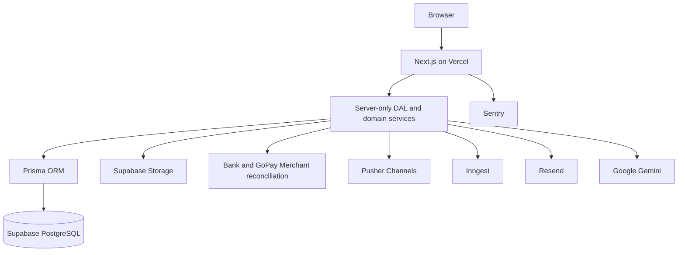
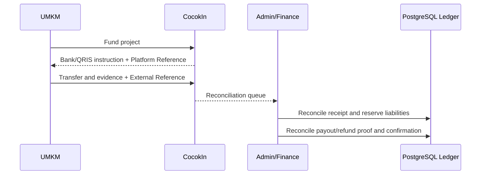

# CocokIn Technical Architecture

> **Status:** Locked architecture baseline  
> **Audience:** Developers  
> **Related:** [`../PRD.md`](../PRD.md), [`BUSINESS_FLOW.md`](BUSINESS_FLOW.md), [`BUSINESS_RULES.md`](BUSINESS_RULES.md), [`DATA_STATE_MODEL.md`](DATA_STATE_MODEL.md)

## 1. Architecture Decision

CocokIn uses a **managed modular monolith**: one Next.js application, one PostgreSQL source of truth, domain modules with explicit boundaries, and managed external providers behind adapters.



Microservices are deferred until a measured scaling or organizational boundary requires them. Domain modules must not import another module's persistence internals; cross-module work uses public domain-service functions and database transactions where atomicity is required.

## 2. Locked Stack

| Concern | Decision |
|---|---|
| Runtime | Node.js 22 LTS |
| Package manager | pnpm |
| Full-stack framework | Next.js 16 App Router + React 19 |
| Language | TypeScript 5 |
| UI styling | Tailwind CSS 4 |
| Component primitives | shadcn/ui source components + Radix UI |
| Icons | Phosphor Icons |
| Forms | React Hook Form for complex forms; native forms for simple actions |
| Validation | Zod 4 at every trust boundary |
| Authentication | Auth.js 5 with database sessions |
| Database | Supabase-managed PostgreSQL 17 |
| ORM and migrations | Prisma 7 |
| Object storage | Supabase Storage |
| Funding | Legal-entity account: bank transfer default, GoPay Merchant QRIS optional |
| Realtime | Pusher Channels; PostgreSQL remains authoritative |
| Background jobs | Inngest |
| Transactional email | Resend + React Email |
| AI assist | Google Gemini behind an adapter |
| Charts | Recharts |
| Error monitoring | Sentry |
| Web analytics | Vercel Analytics + Speed Insights |
| Unit/component tests | Vitest + Testing Library |
| Integration mocks | MSW |
| End-to-end tests | Playwright |
| Source control | GitHub |
| Deployment automation | Vercel Git Integration |

Exact patch versions are selected during foundation setup, committed in `pnpm-lock.yaml`, and updated deliberately. CI and production must use a frozen lockfile.

## 3. Domain Modules

```text
src/modules/
├── identity/          # Auth.js identities, sessions, roles, verification state
├── talent/            # Talent profile, skills, readiness, Skill Passport
├── business/          # UMKM profile, verification, digital readiness
├── marketplace/       # Projects, applications, agreements
├── matching/          # Deterministic Cocok Score and explanations
├── delivery/          # Milestones, submissions, reviews, change requests
├── payments/          # Funding receipts, dual references, reserve, ledger, payout, refund
├── chat/              # Durable project chat and Pusher delivery
├── infrastructure/    # Hosting recommendation and production handover
├── support/           # Warranty, retention guards, maintenance tickets, SLA
├── disputes/          # Evidence, Admin decisions, exceptional outcomes
├── notifications/     # In-app and email notification orchestration
└── impact/            # Portfolio verification, Digital Growth, SDG metrics
```

Each module owns its domain types, Zod schemas, services, data access, and tests. Shared utilities are limited to primitives such as money arithmetic, IDs, clock abstraction, and authorization errors.

## 4. Next.js Runtime Boundaries

### Server Components

Use for authenticated reads and public read-heavy pages:

- Talent, UMKM, and Admin dashboards.
- Marketplace and project detail.
- Skill Passport and verified portfolio.
- Financial summaries and activity timelines.

### Client Components

Use only where browser interactivity is required:

- Assessment and project-creation wizards.
- Recharts visualizations.
- Filters, dialogs, countdown display, and file selection.
- Accessible optimistic feedback where reconciliation is safe.

### Server Actions

Use for UI-originated mutations. Keep actions thin:

```text
Server Action
→ parse Zod input
→ call server-only domain service
→ map known errors to UI result
→ revalidate affected route/tag
```

Server Actions are not used for parallel data fetching or external webhooks.

### Route Handlers

Use for machine-to-machine interfaces:

- Bank/GoPay Merchant reconciliation callbacks where available.
- Pusher private/presence channel authorization.
- Inngest serve endpoint.
- Resend webhooks when delivery tracking is enabled.
- Public verification and health endpoints.

### Authorization

Vercel/Next.js request middleware may redirect anonymous users, but it is not the security boundary. Every domain mutation executes:

```text
Authenticate session
→ authorize role
→ authorize resource ownership
→ verify identity/business status when required
→ verify state transition
→ execute mutation
```

## 5. UI Architecture

### Design foundation

- Plus Jakarta Sans through `next/font`.
- Blue trust palette with Emerald, Amber, and Rose semantic status tokens.
- Medium-density dashboard and progressive disclosure for technical infrastructure choices.
- Phosphor is the only structural icon family.
- WCAG AA contrast, visible focus, keyboard navigation, and reduced-motion support are required.

### Components

Use shadcn/ui as owned source code on top of Radix primitives. Install only components required by a current flow. Do not ship default shadcn styling unchanged; map components to CocokIn semantic tokens and radius rules.

### Forms

React Hook Form is reserved for complex forms. Native `<form>` with Server Actions is preferred for small mutations. Zod validates both client hints and authoritative server input. Failed multi-field forms retain inline errors and focus a linked error summary.

### Charts

Recharts renders Cocok Score, readiness, skill gaps, growth, and impact. Every chart includes visible values, direct labels where practical, keyboard-equivalent detail, and a table fallback. Financial truth is never represented only by a chart.

## 6. Identity and Verification

Auth.js owns login, linked accounts, database sessions, and session revocation. Initial providers are Google OAuth and email/password. Passwords are hashed using a current memory-hard algorithm selected during implementation; password-manager use and paste must remain available.

```text
Role: TALENT | BUSINESS | ADMIN

IdentityStatus:
UNVERIFIED | CONTACT_VERIFIED | KYC_PENDING | KYC_VERIFIED | KYC_REJECTED

BusinessVerificationStatus:
UNVERIFIED | BASIC_VERIFIED | VERIFIED_BUSINESS | REJECTED
```

Role and verification are separate. Progressive KYC is required before a Talent can receive payout. Foundation uses simulated verification; real-money launch requires an approved KYC/AML process.

## 7. Database and Transactions

PostgreSQL is the source of truth. Prisma owns schema migrations and type-safe access.

### Money

- Store IDR as integer minor units; because IDR has no fractional minor unit in this product, `2000000` represents `Rp2.000.000`.
- Use `BigInt` where aggregate volume may exceed JavaScript safe integers.
- Store percentages as basis points: Activation Fee `500`, Success Fee `500`, milestone payout `9000`, and warranty retention `1000`.
- Apply one documented rounding function for all ledger calculations.

### Financial mutation pattern

```text
Verify provider signature
→ reserve idempotency key
→ start serializable/appropriate Prisma transaction
→ verify current state and funded balance
→ insert balanced ledger entries
→ update domain status
→ append immutable audit event
→ commit
→ call or schedule non-database side effects
```

Network calls do not run inside a database transaction. PostgreSQL constraints enforce local invariants; domain services enforce cross-row invariants such as milestone weights totaling 100%.

### Migrations

- Local development: `pnpm prisma migrate dev`.
- Production: manually run `pnpm prisma migrate deploy` before compatible application deployment.
- Never run `prisma db push` against production.
- Destructive changes use expand/migrate/contract releases.

## 8. Object Storage

Supabase Storage is the only object-storage provider. Private buckets store submission evidence, verification documents, dispute evidence, handover exports, and private deliverables. Public portfolio thumbnails use a separate controlled bucket or signed transformations.

Required controls:

- Signed URLs and server-side authorization.
- MIME, extension, and size allowlists.
- Normalized generated object keys.
- File metadata in PostgreSQL.
- Malware scanning before broad production upload access.
- No credential, private key, or production secret uploads.

Supabase Auth is not used. Cloudinary is not used.

## 9. Treasury Funding

The intended production flow receives full Project funding into CocokIn's legal-entity account. Bank transfer is default and GoPay Merchant QRIS is optional. Every movement uses a unique Platform Reference and External Reference.



### Compliance gate

Real-money mode remains disabled until legal counsel, bank/QRIS acquirer, accounting, tax, AML/KYC, reconciliation, treasury, security, and incident controls approve the flow. Internal ledger and 100% reserve do not make CocokIn licensed escrow.

## 10. Realtime Project Chat

Pusher Channels provides private/presence WebSocket delivery. PostgreSQL remains authoritative and Supabase Realtime is not used.

```text
Persist message -> commit -> publish Pusher event
Pusher unavailable -> message remains durable -> client polls/syncs by sequence
```

Server-side channel authorization verifies Auth.js session, Project participation, account state, and conversation access. Client receives only public Pusher key/cluster; app ID and secret remain server-only. Pusher Sandbox limits are development/demo constraints, not unlimited production capacity.

## 11. Background Jobs

Inngest runs durable, retryable workflows:

- Review reminders and 3×24-hour auto-approval.
- Staging availability pause/resume effects.
- Warranty and SLA reminders.
- Day-30 retention release.
- Maintenance expiry.
- Notification delivery retries.
- Portfolio generation and Digital Growth recalculation.
- Payment reconciliation.

Every handler uses a stable event ID/idempotency key. Redis and BullMQ are not used.

## 12. Email and Notifications

Resend sends transactional email rendered with React Email. Production requires a verified sending domain and environment-held API key. Email sends use idempotency keys and are retried through Inngest.

In-app notifications and the immutable activity timeline remain canonical. Email is a delivery channel, not proof that a financial notification was seen. SMS and WhatsApp are outside P0.

## 13. AI Boundary

Google Gemini assists with project drafts, nontechnical explanations, assessment summaries, and explainable matching text.

```text
Minimized domain data
→ prompt template
→ Gemini structured output
→ Zod validation
→ business-rule validation
→ user review
→ persist as draft
```

Gemini cannot approve projects, calculate the authoritative Cocok Score, move money, decide KYC, accept milestones, or resolve disputes. Failure falls back to deterministic matching and project templates.

## 14. Observability

Sentry captures client, server, and route-handler errors, traces, source maps, and structured operational logs. Sensitive fields, payment payloads, KYC evidence, credentials, and dispute documents are scrubbed. Session Replay is disabled on authentication, KYC, payment, and dispute flows.

Vercel Analytics and Speed Insights measure public traffic and Web Vitals. They are not audit or business-metric sources.

## 15. Testing Strategy

| Layer | Tools | Coverage |
|---|---|---|
| Domain unit | Vitest | Cocok Score, money, fee split, retention, state guards, SLA, quotas |
| Component | Testing Library | Forms, accessibility, review decisions, role-specific UI |
| Integration | Vitest + MSW | Bank/QRIS reconciliation, Pusher, Gemini, Resend, storage, idempotency |
| End-to-end | Playwright | Onboarding through funding, delivery, handover, warranty, and dispute |

Playwright targets Chromium, Firefox, WebKit, and a 375px mobile viewport for critical flows.

## 16. Source Control and Deployment

### GitHub

GitHub is used only for source control and collaboration:

- Feature/fix/docs branches.
- Pull Requests and code review.
- Issues, tags, and release notes.
- Branch protection.

**GitHub Actions is not used.**

### Local quality gate

Before push, developers run:

```text
pnpm lint
pnpm typecheck
pnpm test
pnpm build
pnpm test:e2e  # when critical flow changes
```

The project exposes `pnpm verify` for lint, typecheck, unit tests, and build. Each task records verification in its GitHub Issue; release verification is recorded in the `dev` to `main` Pull Request.

### Vercel Git Integration

```text
Task commit pushed to dev
→ Vercel Preview/Staging Deployment
→ Integration and local quality confirmation
→ Pull Request dev to main
→ Vercel Production Deployment
```

Vercel build failure blocks that deployment. Preview uses a synthetic-data staging Supabase project; production uses a separate Supabase project. Preview never migrates or reads production data.

## 17. Deliberate Non-Choices

| Not selected | Reason |
|---|---|
| Microservices | No measured scale or team boundary justifies operational overhead. |
| Express/NestJS backend | Next.js backend-for-frontend and domain services cover current requirements. |
| Supabase Auth | Auth.js is the single identity/session owner. |
| Cloudinary | Supabase Storage avoids duplicate storage providers. |
| Redis/BullMQ | Inngest provides durable scheduled workflows without worker infrastructure. |
| Redux/Zustand by default | Server state and local component state are sufficient initially. |
| GraphQL | No client/data requirement justifies schema and resolver overhead. |
| GitHub Actions | The team selected local quality checks and Vercel Git deployments. |
| CocokIn-hosted GitLab/CI/CD | Talent submits staging URLs; CocokIn does not execute arbitrary project code. |
| CocokIn-hosted VPS | UMKM production infrastructure remains provider-owned. |
